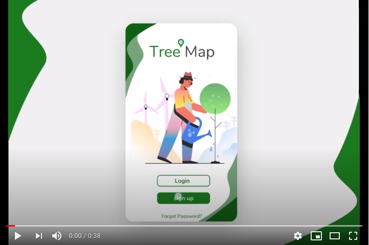

# Tree Map  :construction: :wrench: :nut_and_bolt:
A tree planting android app for all those who love planting trees(Arborists) and for the greater good of mother nature,it's inspired by the [Rotaract Club Of Taita Taveta University](https://twitter.com/RotaractClubTTU),[Rotaract Club Of Voi](https://twitter.com/RotaractVoi) and [Rotary Club of Voi ](https://twitter.com/RotaryVoi) who devoted they time once a while to plant trees as a way of giving back to our ecosystem. The app takes into account trees planted by different individuals, their species, region and exact geopoint. A feature in progress is to send reminder's to Arborist to water their trees based on the Tree type.

# APK
[TreeMap APK](app/build/outputs/apk/debug/app-debug.apk)

# Demo
``` Credits to :``` [Joseph Githumbi](https://github.com/githumbi) ``` A UI/UX Designer.```
[](https://app.codacy.com/manual/Paulmburu/Tree_Map?utm_source=github.com&utm_medium=referral&utm_content=Paulmburu/Tree_Map&utm_campaign=Badge_Grade_Dashboard)
[](https://youtu.be/deC_NG0g9TM)

# Screenshots
<br />
<p align="center">
<image src="screenshots/1.png" width="600">

An android app for tracking young trees :evergreen_tree::evergreen_tree::evergreen_tree:.

# splash / Login / Signup pages

<image src="screenshots/2.png" width="400">

# add tree to Map 

<image src="screenshots/3.png" width="400">

# Profile page
<image src="screenshots/4.png" width="400">

# Settings page
<image src="screenshots/5.png" width="400">

Libraries Used
--------------
* [Architecture][1] - A collection of libraries that help you design robust, testable, and
  maintainable apps. Start with classes for managing your UI component lifecycle and handling data
  persistence.
  * [Data Binding][2] - Declaratively bind observable data to UI elements.
  * [Lifecycles][3] - Create a UI that automatically responds to lifecycle events.
  * [LiveData][4] - Build data objects that notify views when the underlying database changes.
  * [Navigation][5] - Handle everything needed for in-app navigation.
  * [Room][6] - Access app's SQLite database with in-app objects and compile-time checks.
  * [ViewModel][7] - Store UI-related data that isn't destroyed on app rotations.
* Third party
  * [Kotlin Coroutines][12] for managing background threads with simplified code and reducing needs for callbacks
* UI
  * [Fragment][34] - A basic unit of composable UI.

[1]: https://developer.android.com/jetpack/arch/
[2]: https://developer.android.com/topic/libraries/data-binding/
[3]: https://developer.android.com/topic/libraries/architecture/lifecycle
[4]: https://developer.android.com/topic/libraries/architecture/livedata
[5]: https://developer.android.com/topic/libraries/architecture/navigation/
[6]: https://developer.android.com/topic/libraries/architecture/room
[7]: https://developer.android.com/topic/libraries/architecture/viewmodel
[8]: https://developer.android.com/topic/libraries/architecture/workmanager
[9]: https://square.github.io/retrofit/
[10]: https://github.com/square/moshi
[11]: https://bumptech.github.io/glide/
[12]: https://kotlinlang.org/docs/reference/coroutines-overview.html
[13]: https://github.com/JakeWharton/timber
[34]: https://developer.android.com/guide/components/fragments


## License

MIT License

Copyright (c) 2020 Paul Mburu

Permission is hereby granted, free of charge, to any person obtaining a copy
of this software and associated documentation files (the "Software"), to deal
in the Software without restriction, including without limitation the rights
to use, copy, modify, merge, publish, distribute, sublicense, and/or sell
copies of the Software, and to permit persons to whom the Software is
furnished to do so, subject to the following conditions:

The above copyright notice and this permission notice shall be included in all
copies or substantial portions of the Software.

THE SOFTWARE IS PROVIDED "AS IS", WITHOUT WARRANTY OF ANY KIND, EXPRESS OR
IMPLIED, INCLUDING BUT NOT LIMITED TO THE WARRANTIES OF MERCHANTABILITY,
FITNESS FOR A PARTICULAR PURPOSE AND NONINFRINGEMENT. IN NO EVENT SHALL THE
AUTHORS OR COPYRIGHT HOLDERS BE LIABLE FOR ANY CLAIM, DAMAGES OR OTHER
LIABILITY, WHETHER IN AN ACTION OF CONTRACT, TORT OR OTHERWISE, ARISING FROM,
OUT OF OR IN CONNECTION WITH THE SOFTWARE OR THE USE OR OTHER DEALINGS IN THE
SOFTWARE.
